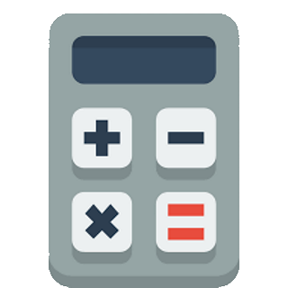

# ioBroker.smartstate

**Tests:** 

## smartstate adapter for ioBroker

With this adapter you can create states which are cummulations of other states 
A good example is, if you want to create a state which count lights which are on (see examples) 
The handling is very easy. Add a new smart state, define it's name and type and add child states which will be used to calculate the states value by the given type (operator)

## Getting started

* Set the artnet settings in the adapter to connect to a ARTNET node device
    * Smartstate settings
        | Field | Description |
        |-------------|-------------|
        | `Name` | The name of the smartstate |
        | `Id` | The id of the smartstate |
        | `Type` | Calculation type which defines how the smartstate uses the child to calculate its value |
        | `Calc only for ACK values` | If checked, only state values which are acknowledged will trigger a recalulation |
    * Child Settings
        | Field | Description |
        |-------------|-------------|
        | `Type` | the `state` type will allow a selection of one state , the `pattern` type will allow a state selection pattern |
        | `Id/Pattern` | the state id or the pattern |        

## Example        

## Changelog
<!--
    Placeholder for the next version (at the beginning of the line):
    ### **WORK IN PROGRESS**
-->

### **WORK IN PROGRESS**

* (ChriD) initial release

## License
MIT License

Copyright (c) 2023 ChriD <chris_d85@hotmail.com>

Permission is hereby granted, free of charge, to any person obtaining a copy
of this software and associated documentation files (the "Software"), to deal
in the Software without restriction, including without limitation the rights
to use, copy, modify, merge, publish, distribute, sublicense, and/or sell
copies of the Software, and to permit persons to whom the Software is
furnished to do so, subject to the following conditions:

The above copyright notice and this permission notice shall be included in all
copies or substantial portions of the Software.

THE SOFTWARE IS PROVIDED "AS IS", WITHOUT WARRANTY OF ANY KIND, EXPRESS OR
IMPLIED, INCLUDING BUT NOT LIMITED TO THE WARRANTIES OF MERCHANTABILITY,
FITNESS FOR A PARTICULAR PURPOSE AND NONINFRINGEMENT. IN NO EVENT SHALL THE
AUTHORS OR COPYRIGHT HOLDERS BE LIABLE FOR ANY CLAIM, DAMAGES OR OTHER
LIABILITY, WHETHER IN AN ACTION OF CONTRACT, TORT OR OTHERWISE, ARISING FROM,
OUT OF OR IN CONNECTION WITH THE SOFTWARE OR THE USE OR OTHER DEALINGS IN THE
SOFTWARE.